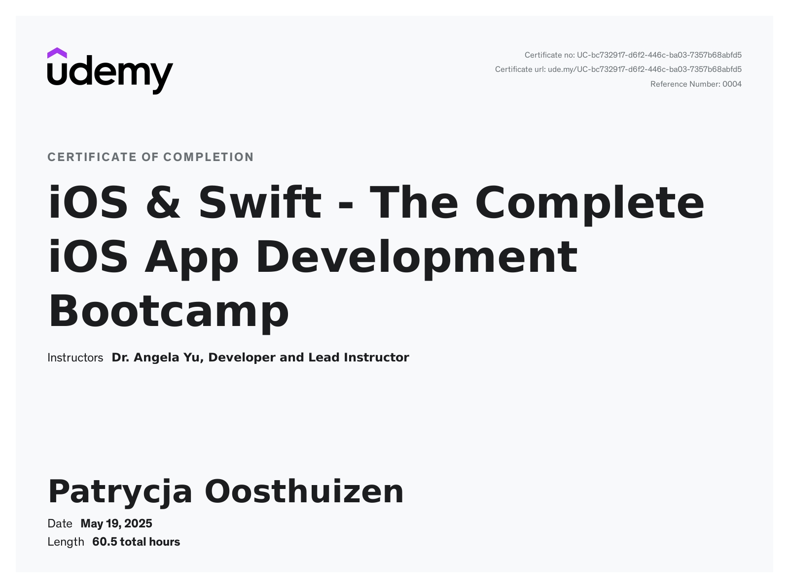

## 📂 About This Repository

This repository is a collection of my code snippets, mini-projects, and full-scale applications developed as part of **The Complete iOS App Development Bootcamp** by Dr. Angela Yu. It includes hands-on exercises and projects covering core iOS development concepts such as Swift programming, UIKit, SwiftUI, Core Data, networking, APIs, Firebase integration, ARKit, and CoreML. This repo serves both as a personal learning archive and a showcase of the practical skills I’ve acquired throughout the course.

## 🏆 Certificate of Completion

## 🎥 Watch a Demo of My Augmented Reality Pokémon Card Project  

## 📂 About 📱 iOS 13 & Swift 5 – The Complete iOS App Development Bootcamp

A comprehensive Udemy course by **Dr. Angela Yu** designed to teach complete beginners how to build iOS apps using **Swift 5** and **iOS 13 SDK**.

---

## 📦 Course Contents

- ✅ Swift 5.1 programming fundamentals
- ✅ iOS 13 app development using Xcode 11
- ✅ UI development with UIKit and SwiftUI
- ✅ ARKit – Build augmented reality apps
- ✅ CoreML – Integrate machine learning
- ✅ Core Data – Manage app data persistently
- ✅ Firebase & Cloud Firestore integration
- ✅ RESTful APIs and JSON parsing
- ✅ Git, GitHub & Version Control
- ✅ App publishing & marketing strategies

---

## 💡 What You’ll Build

You’ll create **15+ fully functional iOS apps**, including:

- 📷 A camera and image recognition app using CoreML
- 🌦 A weather forecast app using OpenWeather API
- 🐦 A Twitter-style messaging app with Firebase
- 🧭 A quiz app with animations
- 🔢 A calculator app with custom UI
- 🧠 A memory game
- 🧪 Augmented Reality experiences using ARKit

---

## 🎯 Target Audience

- 🚀 Beginners with no coding experience
- 🛠 Developers switching to iOS development
- 📱 Anyone looking to build and launch iOS apps on the App Store

---

## 🧑‍🏫 About the Instructor

**Dr. Angela Yu** is the lead instructor at the London App Brewery. With her clear teaching style and engaging approach, she has taught millions of students how to code.

---

## 📚 Course Features

- 🎥 55+ hours of HD video content
- 💻 Hands-on, project-based learning
- 📱 Access on mobile & TV
- 🆓 Lifetime access
- 📜 Certificate of completion
- 🔄 Regular updates

---

## 🌐 Link to Course

[👉 Enroll on Udemy](https://www.udemy.com/course/ios-13-app-development-bootcamp/)

---
Happy coding! 🚀
